# Real-Time Grid Frequency Monitoring and Data-Driven Prediction

**Best Undergraduate Project Award, KUCAP 2025** — Kathmandu University, Dept. of Electrical & Electronics Engineering

## Abstract
Ensuring stability of an electrical grid is crucial for reliable power distribution, and
grid frequency monitoring plays a vital role in maintaining this stability. This project
presents a system for real-time monitoring and detailed analysis of grid frequency using
a voltage sensor and a microcontroller. The voltage sensor measures the AC mains voltage
and provides a conditioned signal that is processed by the microcontroller. By employing
zero-crossing detection, the system accurately determines the frequency of the grid. The
acquired data is then transmitted to an IoT-based dashboard, enabling remote
visualization of frequency variations. Additionally, the system performs an in-depth
analysis of frequency trends to identify patterns and potential instabilities. Alerts can
also be generated for abnormal fluctuations, facilitating proactive grid stability
analysis. This approach enhances real-time monitoring capabilities and contributes to
the efficient management of power systems.

## Team
- Ayushma Bhandari
- Shishir Kumar Bhattarai
- Rohan Thapa

**Supervisor**: Asst. Prof. Dr. Samundra Gurung

**My contribution**: "PowerFactory dynamic modeling and simulation cases, ROCOF analysis, and the ML frequency prediction module."
## What It Does
1. **Hardware measurement** — An ESP32 + ZMPT101B voltage sensor measures AC mains
   voltage and computes grid frequency in real time via zero-crossing detection,
   displayed on an LCD and streamed to a Node-RED dashboard.
2. **Site validation at a live hydropower plant** — Component behavior was cross-checked
   against a real synchronous generator and governor system at Sunkoshi Hydropower,
   Sindhupalchok District (see [Site Visit](#site-visit) below).
3. **Power system modeling** — A section of Nepal's central-region grid (Bhotekoshi,
   Sunkoshi, and Indrawati hydropower plants feeding Lamosangu, Panchkhal, Banepa, and
   Bhaktapur substations) was modeled in DIgSILENT PowerFactory. Load flow and dynamic
   simulations were run for four disturbance cases: load increment, load decrement,
   load outage, and generator outage.
4. **Real-world validation** — A measured 5.47% load increment from actual Banepa
   substation data was applied in simulation and compared against 24-hour hardware
   frequency recordings, validating the model against real system behavior.
5. **ML-based frequency prediction** — Linear regression, polynomial regression
   (degree 2 and 3), and Random Forest models were trained on historical frequency data
   to predict future frequency at arbitrary timestamps, with an interactive prediction
   interface.

## System Architecture
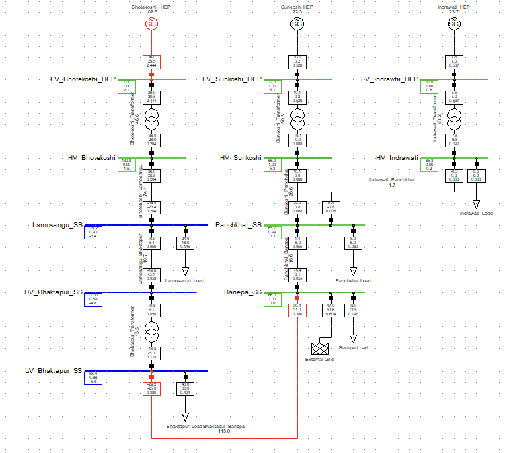
*Modeled section of Nepal's central-region grid: Bhotekoshi, Sunkoshi, and Indrawati
hydropower plants feeding Lamosangu, Panchkhal, Banepa, and Bhaktapur substations.*

## Site Visit
Site validation was carried out at **Sunkoshi Hydropower, Sindhupalchok District** to
ground the model in real equipment behavior.

| Electrical Component | Description |
|---|---|
| Generator | Synchronous Generator (300 rpm) |
| Excitation System | DC Excitation (Dry-type) |
| Governor System | Oil Governor, manually operated |
| Frequency | 49.5–50 Hz variation observed |
| Transformer | Step-up, 6.3 kV / 66 kV |

<table>
<tr>
<td>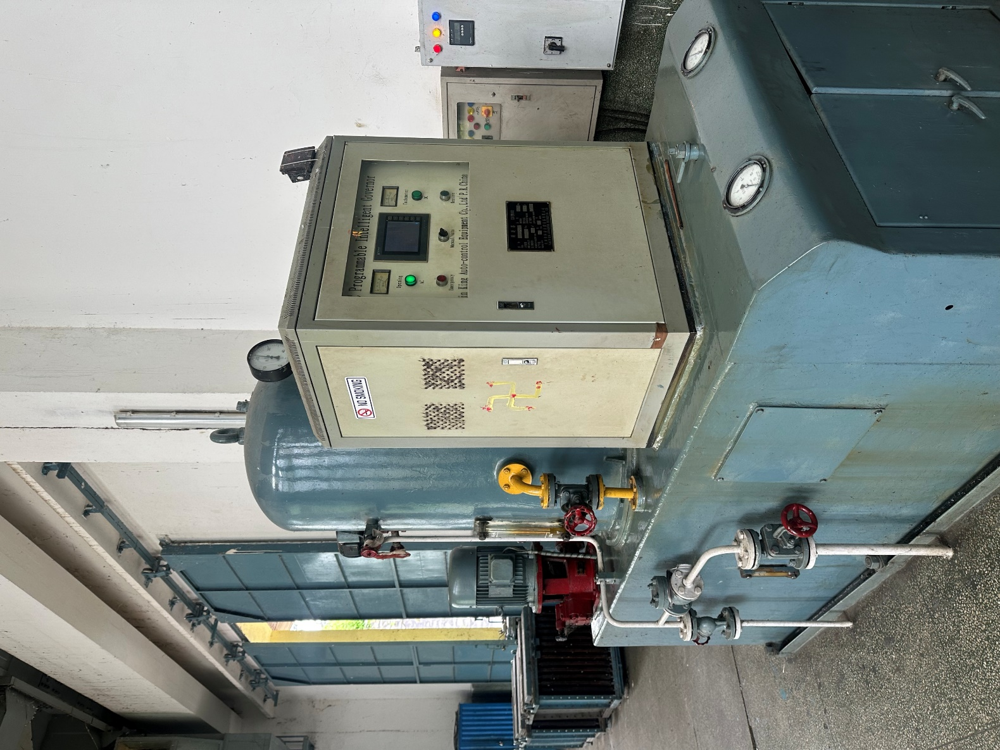<br/>Oil governor system</td>
<td>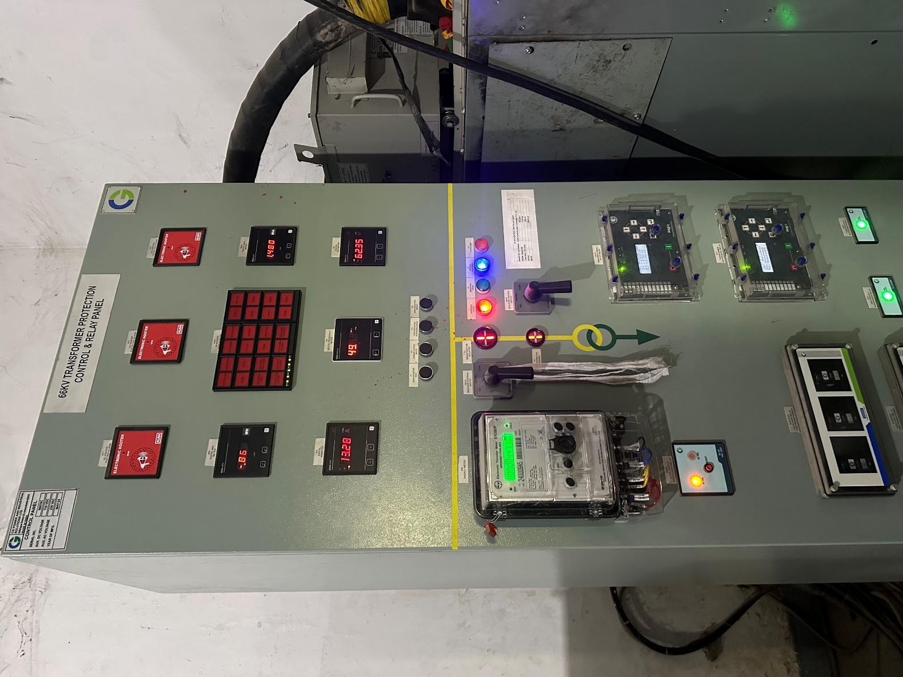<br/>66 kV transformer protection, control & relay panel</td>
</tr>
</table>

## Hardware Setup
The measurement unit uses an ESP32, a ZMPT101B voltage sensor, a filter circuit, and an
I2C LCD display, powered by a portable power bank for isolated operation.

<table>
<tr>
<td>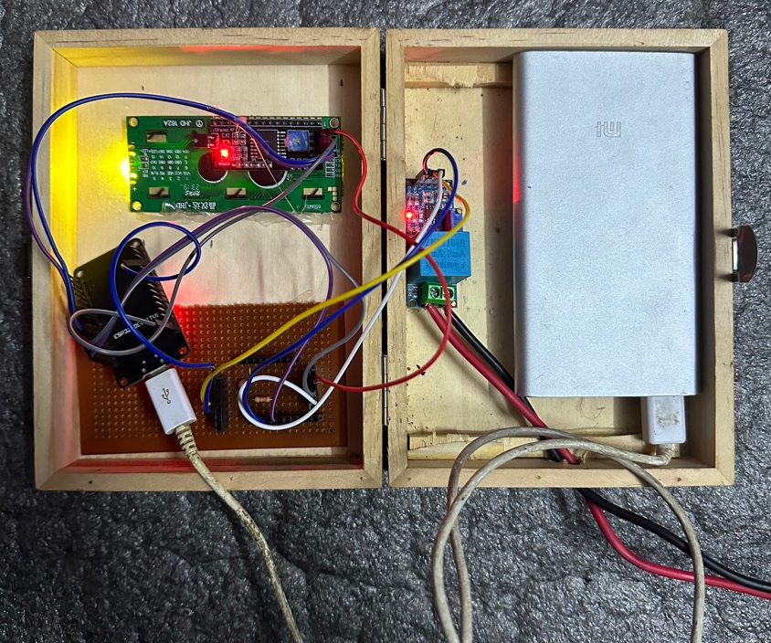<br/>Internal wiring: ESP32, filter circuit, power bank</td>
<td>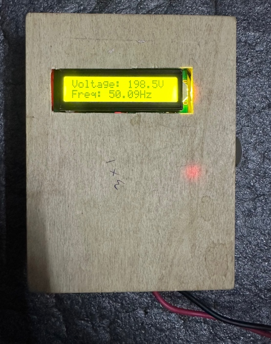<br/>Live LCD readout: voltage and frequency</td>
</tr>
</table>

## Key Results

| Case | Max ROCOF (Hz/s) | Steady-State Deviation (Hz) |
|---|---|---|
| Load increment (+50%) | 0.338 (Lamosangu) | 0.000039 |
| Load decrement (−50%) | 0.396 (Lamosangu) | 0.000044 |
| Load outage | 0.303 (Lamosangu) | 0.000013 |
| Generator outage | 0.076 (Indrawati) | 0.000008 |

**Model validation against real substation data:**
A measured 5.47% load increment from actual Banepa substation load data was applied to
the PowerFactory model. The simulated response and the hardware-measured response for
the same period both show the same damped-oscillation pattern returning to nominal
frequency:

<table>
<tr>
<td>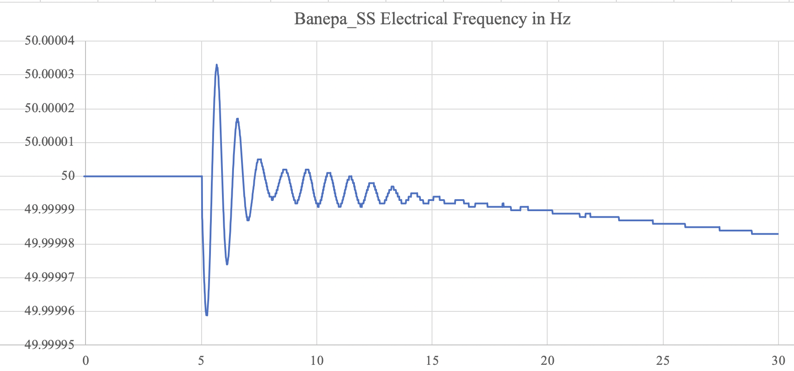<br/>Simulated response (PowerFactory)</td>
<td>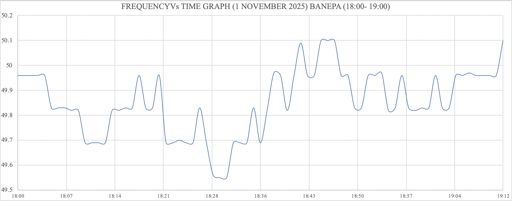<br/>Hardware-measured response (peak hour)</td>
</tr>
</table>

**24-hour hardware recordings** stayed within 49.7–50.2 Hz on both measurement days:

<table>
<tr>
<td>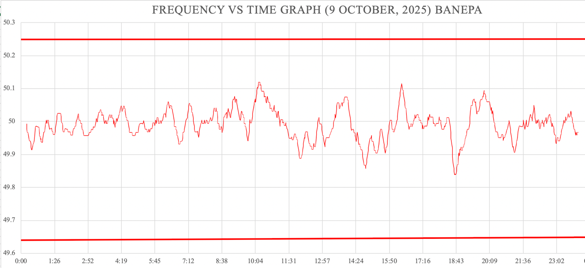<br/>9 October 2025</td>
<td>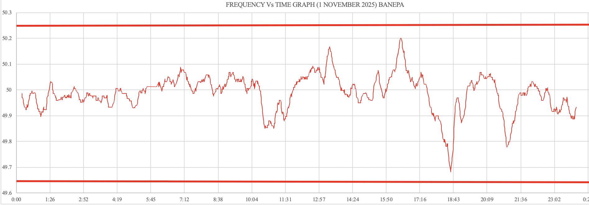<br/>1 November 2025</td>
</tr>
</table>

**ML prediction model**, trained on 4,271 data points (mean 50.006 Hz, std dev 0.29 Hz),
via an interactive interface for predicting frequency at any timestamp:

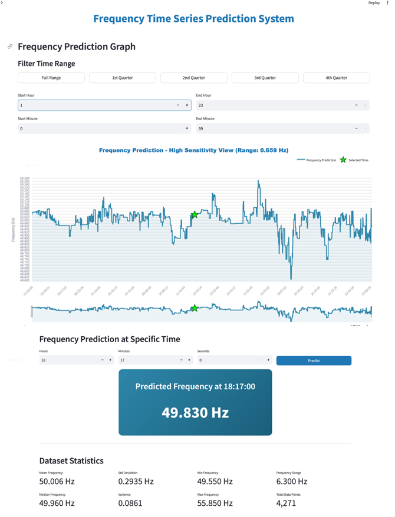

**Real-time Node-RED dashboard**, streaming live frequency from the hardware over MQTT:

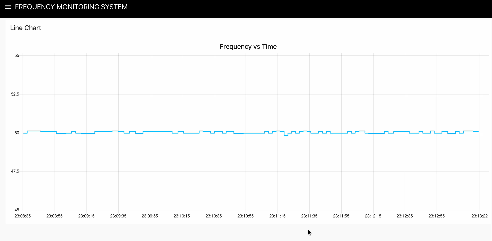

## Repository Structure
```
├── hardware/
│   ├── arduino_frequency_measurement.ino   # ESP32 firmware (zero-crossing detection)
│   └── config.h.example                    # WiFi/MQTT config template (no real credentials)
├── simulation/
│   ├── powerfactory_model/                 # PowerFactory project files (add yours)
│   └── dynamic_simulation_results/         # Banepa bus response per disturbance case
├── ml_prediction/
│   ├── frequency_predictor.py              # Linear/Polynomial/Random Forest models
│   └── requirements.txt
├── dashboard/
│   └── node_red_dashboard_screenshot.png
├── results/
│   ├── load_flow_diagram.png
│   ├── site_visit/
│   ├── hardware_*.png / .jpeg
│   ├── simulated_banepa_5.47pct_increment.png
│   └── ml_prediction_dashboard.png
├── report/
│   └── project_summary.md                  # short write-up (no full PDF)
└── README.md
```

## Setup

### Hardware
1. Copy `hardware/config.h.example` to `hardware/config.h` and fill in your real WiFi
   SSID, password, and MQTT broker details.
2. `hardware/config.h` is listed in `.gitignore` — it will never be pushed to GitHub.
3. Flash `arduino_frequency_measurement.ino` to an ESP32 via Arduino IDE.

### ML Prediction Module
```bash
cd ml_prediction
pip install -r requirements.txt
python frequency_predictor.py
```

## Why This Matters
This project demonstrates a full pipeline relevant to modern power system monitoring:
physical sensing validated against real hydropower plant equipment, dynamic stability
analysis under standard disturbance cases (load/generator loss), and data-driven
prediction — all cross-checked against real operational data from a hydropower-dominated
grid. It reflects hands-on experience bridging embedded systems, power system dynamics,
and machine learning.

## Limitations and Future Work
- Machine parameters used default values rather than site-specific parameters.
- Future work: extend monitoring to more substations within the network, and retrain
  prediction models on larger long-term datasets for improved accuracy.

## Note on the Simulation Case Plots
The four plots in `simulation/dynamic_simulation_results/` (Banepa bus response) were
recovered from the defense presentation, but which file corresponds to which disturbance
case (load increment / decrement / outage, generator outage) wasn't labeled in the
source file. Match them against the steady-state deviation values in the Key Results
table above (each case has a distinct Banepa deviation range) and rename the files
accordingly before publishing.

